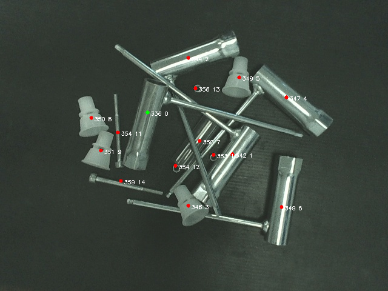

# Picking Point
Algorithm to get the best picking point given a mask and a depth map 

## Dependencies
`OpenCV, builded with OpenEXR  enabled`   
`VTK`  
`Iconv`  
`Eigen3`  
`PCL 1.8`  

## Build
`cmake .`  
`make`  

## Run
`bin/Application`  
  
## Images

